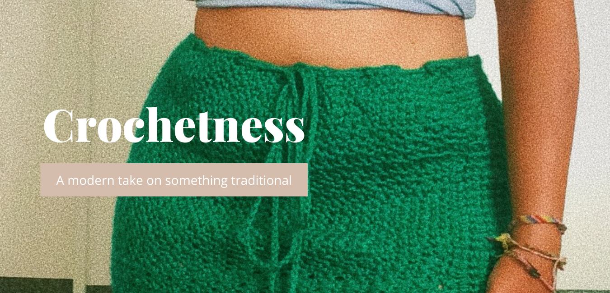
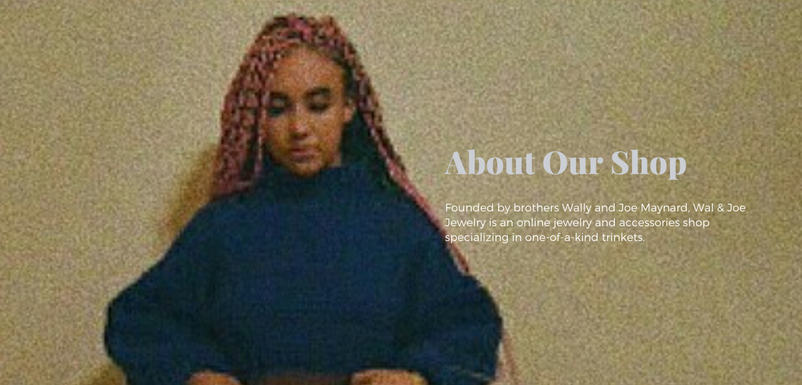
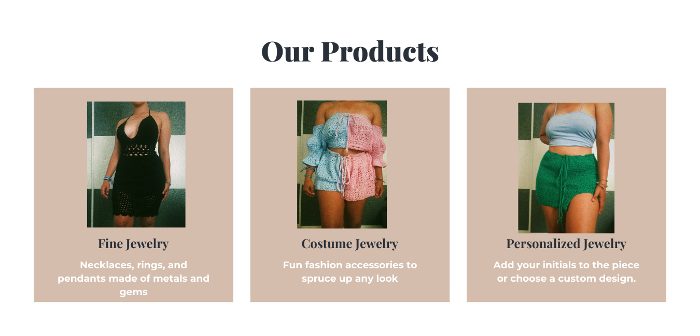
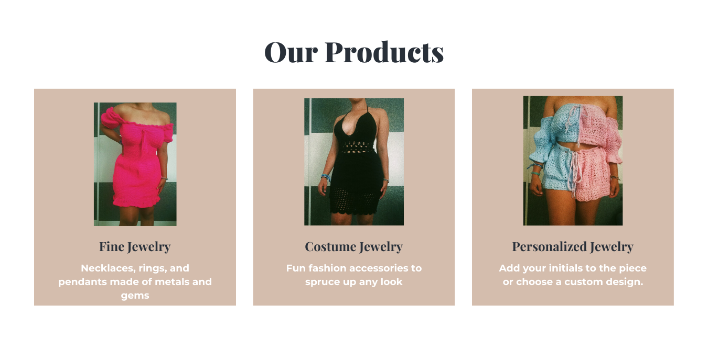
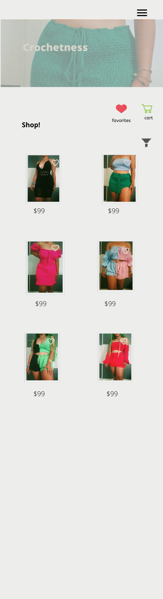

# eCommerce App for Crochetness

I am creating an eCommerce App for a teenage entrepreneur who crochets outfits (mainly dresses). I love her work because it's a modern take on a very old-school concept, so I offered to create a website for her. 

## User View
The landing page, the shopping page (with filters), and the product pages
Shows pictures and users can favorite and click to order and put into the their cart!

## Admin View
I want Jaclyn to be able to upload her new work!

## Front End Routes within the User View

1. Home
2. About My Store
3. Products Previews
4. Shopper Reviews

5. Shopping

* Store page 
* Product Page

## Later Features
1. Users can submit reviews
2. Users can add pictures of themselves in the clothes on Instagram

## Design

Will slide horizontally between these views

